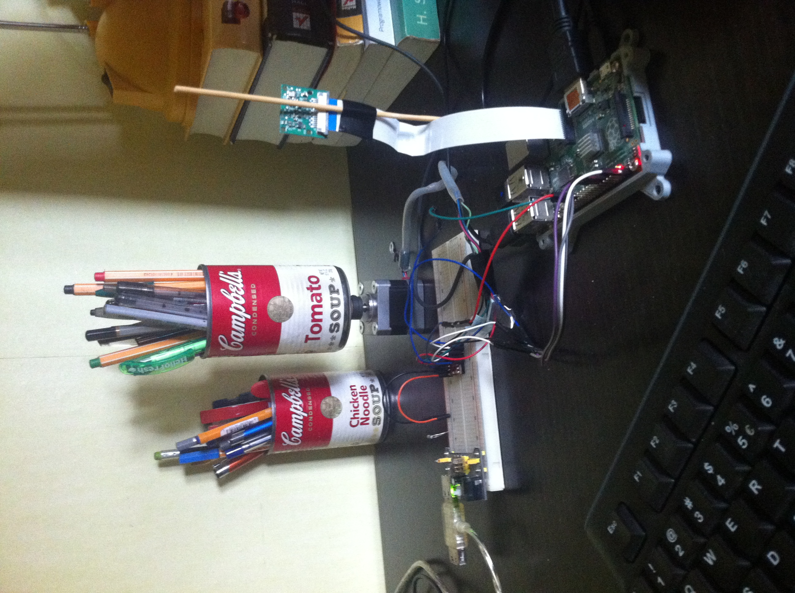

piCAN
----- 

Revolving can controlled by users via Flask web app.

Access to hardware can be granted to users one by at a time so website implements virtual queue.

Actions performed by user can be seen on webcam view.

### Software setup:

`main_server.py` web app adds user to queue and provides control buttons and view

`main_pi.py` Flask server on Raspberry Pi which provides access to hardware (REST API)

### Hardware setup:

- Raspberry Pi 2B+
- Raspberry Pi camera
- Pololu MP6500 Stepper Motor Driver
- Vexta px244m-01a-c7 

